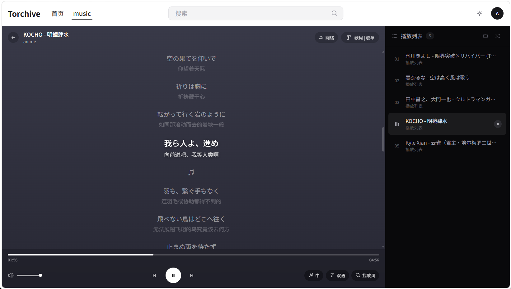
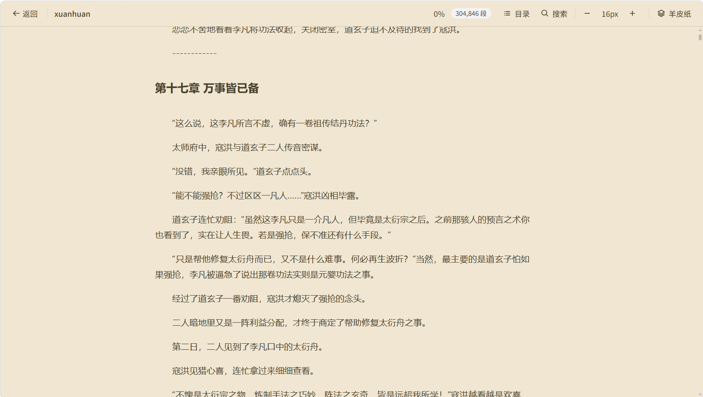

# Torchive

媒体资源管理与播放平台 — 单仓多包（pnpm workspace）。

<table>
  <tr>
    <td align="center"><b>视频</b></td>
    <td align="center"><b>音乐</b></td>
  </tr>
  <tr>
    <td></td>
    <td></td>
  </tr>
  <tr>
    <td align="center"><b>漫画</b></td>
    <td align="center"><b>小说</b></td>
  </tr>
  <tr>
    <td></td>
    <td></td>
  </tr>
</table>


## 仓库结构

```
torchive/
├── apps/
│   ├── web/         # React 19 + Vite + Tailwind v4 前端
│   └── api/         # NestJS 11 + TypeORM + better-sqlite3 后端
├── packages/
│   └── shared/      # 前后端共享的 TypeScript 类型（@torchive/shared）
├── docs/
│   ├── DESIGN.md            # 设计令牌
│   └── screenshots/         # README 用截图
├── pnpm-workspace.yaml
└── CLAUDE.md
```

## 快速开始

```bash
# 安装依赖（pnpm 必须 >= 9）
pnpm install

# 同时启动前后端（前端 :5173，后端 :2333）
pnpm dev

# 或单独启动
pnpm dev:web
pnpm dev:api

# 校验
pnpm lint
pnpm build
pnpm typecheck
```

前端通过 Vite 代理 `/ts-api/* → http://localhost:2333`，启动顺序不强制，但若只跑前端则调用会 502。

## 工作流

- 改动 `apps/web` 或 `apps/api` → 跑对应子目录的 `pnpm lint && pnpm build`
- 改动 `packages/shared` → 在前端 build 中会一起校验
- 提交信息 emoji 前缀：`✨ feat` / `🎈 perf` / `🐛 fix` / `📝 docs` 等

## 历史

本仓由原本分开的 `D:\MGit-Projects\torchive`（前端）和 `D:\MGit-Projects\torchive-server`（后端）合并而成。原始目录保留作 rollback 用。
