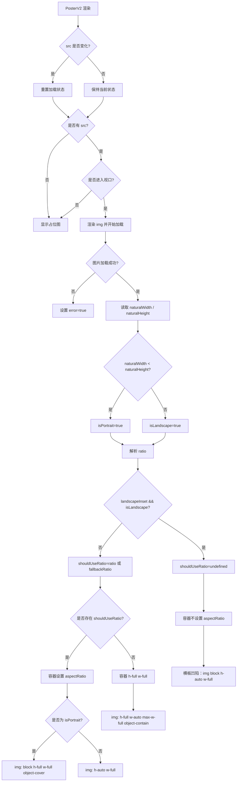

# PosterV2

`PosterV2` 是用于展示封面图的懒加载组件。它会在图片进入视口后加载资源，并在图片加载完成后根据图片原始宽高判断横竖方向，再决定容器比例和图片填充方式。

## Props

| Prop | Type | Default | Description |
| --- | --- | --- | --- |
| `src` | `string` | - | 图片地址。 |
| `alt` | `string` | `""` | 图片替代文本。 |
| `ratio` | `string` | - | 可选比例，例如 `"3/4"`、`"2/3"`、`"16/9"`。 |
| `fallbackRatio` | `number \| string` | `0.74` | 未传 `ratio` 且容器高度塌缩时使用的兜底比例。 |
| `landscapeInset` | `boolean` | `false` | 横板凹陷。开启后，横板图片不使用 `ratio`，宽度占满，高度自然撑开。 |
| `className` | `string` | - | 外层容器 class。 |
| `imgClassName` | `string` | - | 图片 class。 |

## Rendering Rules

- 图片默认懒加载：只有进入视口后才会开始渲染 ``。
- 图片加载成功后，通过 `naturalWidth` 和 `naturalHeight` 判断方向。
- `ratio` 优先级高于 `fallbackRatio`。
- `fallbackRatio` 只在未传 `ratio` 且容器高度塌缩时启用。
- 只有 `shouldUseRatio && isPortrait` 时，图片才会 `object-cover` 并铺满比例容器。
- 横板图片默认仍可使用比例容器，但图片尺寸为 `w-full h-auto`。
- 开启 `landscapeInset` 后，横板图片会取消比例容器，使用自然高度撑开。

## Flow



## Examples

```tsx
<PosterV2 src={cover} alt={title} ratio="3/4" />
```

```tsx
<PosterV2 src={cover} alt={title} ratio="3/4" landscapeInset />
```
